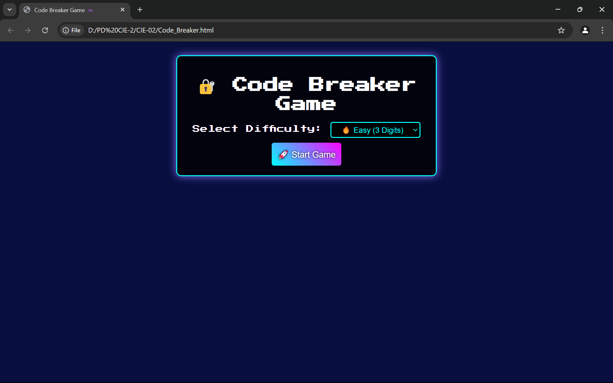
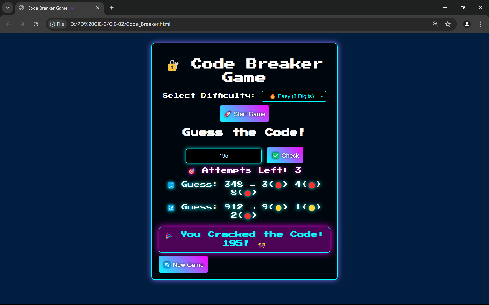
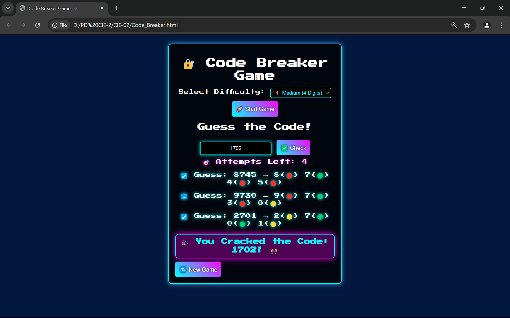
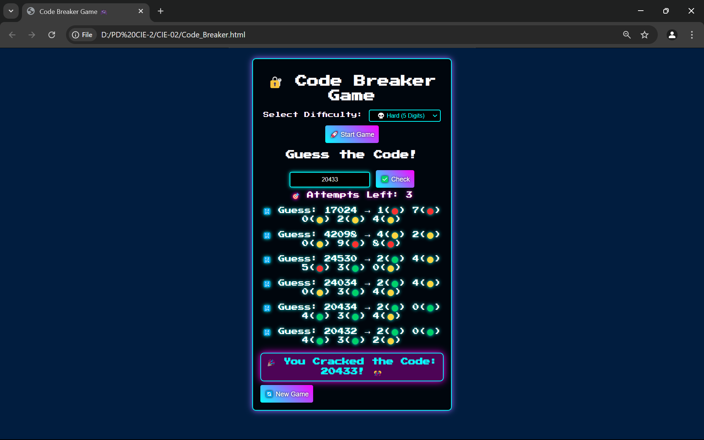

Here’s your **README.md** file with **detailed documentation**, **extra emojis**, and **GitHub-friendly formatting**! 🚀🎮  

---

# **🔐 Code Breaker Game** 🎮💡  

  

## **🌟 Introduction**  
The **Code Breaker Game** is an interactive **number-guessing challenge** where players attempt to **crack a secret code** within a **limited number of attempts**. 💻🔥 The game features a **futuristic neon UI**, dynamic **emoji-based feedback**, and **multiple difficulty levels** to test your logic skills. 🧠✨  

---

## **🚀 Features**  
✅ **3 Difficulty Levels:**  
   - 🔥 **Easy** (3-digit code, 5 attempts)  
   - ⚡ **Medium** (4-digit code, 7 attempts)  
   - 💀 **Hard** (5-digit code, 9 attempts)  

✅ **Real-time Emoji Feedback:**  
   - 🟢 **Correct digit & position**  
   - 🟡 **Correct digit but wrong position**  
   - 🔴 **Incorrect digit**  

✅ **Neon-Themed UI:**  
   - 💡 Glowing **neon effects** 🎆  
   - 🎨 Stylish **animated buttons & borders**  

✅ **Interactive Gameplay:**  
   - 🎯 **Shows the secret code** if you lose  
   - 🔄 **Restart button** for new challenges  

---

## **📸 Screenshots**  
🔹 **Game Start:**  
  

🔹 **Playing the Game:**  
  

🔹 **Game Over Screen:**  
  

---

## **🛠️ Technologies Used**  
- **🌐 Frontend:** HTML, CSS, JavaScript  
- **🎨 Styling:** Google Fonts, CSS Animations  
- **⚡ Interactivity:** JavaScript (DOM Manipulation, Event Handling)  

---

## **📜 How to Play?**  
1️⃣ **Select Difficulty** (Easy, Medium, Hard) from the dropdown.  
2️⃣ **Click "Start Game"** 🚀 to generate a **random secret code**.  
3️⃣ **Enter Your Guess** in the input box and **click "Check"** ✅.  
4️⃣ **Get Feedback** (🟢🟡🔴) based on the correctness of your digits.  
5️⃣ **Crack the Code** before attempts run out! 🏆  
6️⃣ **If you lose**, the **secret code is revealed** 💬. Click **New Game** 🔄 to try again.  

---

## **🔧 Installation & Setup**  
Clone this repository to your local machine:  

```bash
git clone https://github.com/your-username/code-breaker-game.git
```

Open `index.html` in any modern browser and enjoy the game! 🚀🎮  

---

## **📝 Code Structure**  

📁 **Project Files:**  
```
📂 Code-Breaker-Game
│── 📄 index.html    # Main HTML structure
│── 🎨 style.css     # Neon UI styling (if separated)
│── ⚡ script.js      # Game logic & interactions
│── 📜 README.md     # Project Documentation
```

---

## **🛠️ Game Logic Breakdown**  
📌 **`startGame()`** – Initializes game & sets secret code based on difficulty.  
📌 **`checkGuess()`** – Compares user input with secret code & provides feedback.  
📌 **`showSecretCode()`** – Displays the secret code if the player runs out of attempts.  
📌 **`resetGame()`** – Resets everything for a new game session.  

---

## **🎯 Future Enhancements**  
🔹 **⏳ Timer Mode** – Beat the clock ⏱️  
🔹 **🏆 Scoreboard & Leaderboard** – Track performance 🥇  
🔹 **🎭 Multiplayer Mode** – Play with friends 👥  
🔹 **💡 Hint System** – Get help when stuck 🧩  

---

## **📢 Contributing**  
🚀 **Want to improve this game?** Feel free to fork, modify, and send pull requests!  

1. Fork the repo 🍴  
2. Create a new branch 🚧 (`feature-your-feature-name`)  
3. Make your changes 🛠️  
4. Commit & push 📤  
5. Create a pull request ✅  

---

📣 **If you like this project, don't forget to ⭐ it on GitHub!** 🌟🎮  

---

🚀 **Happy Code Breaking! 🔐🎉**









