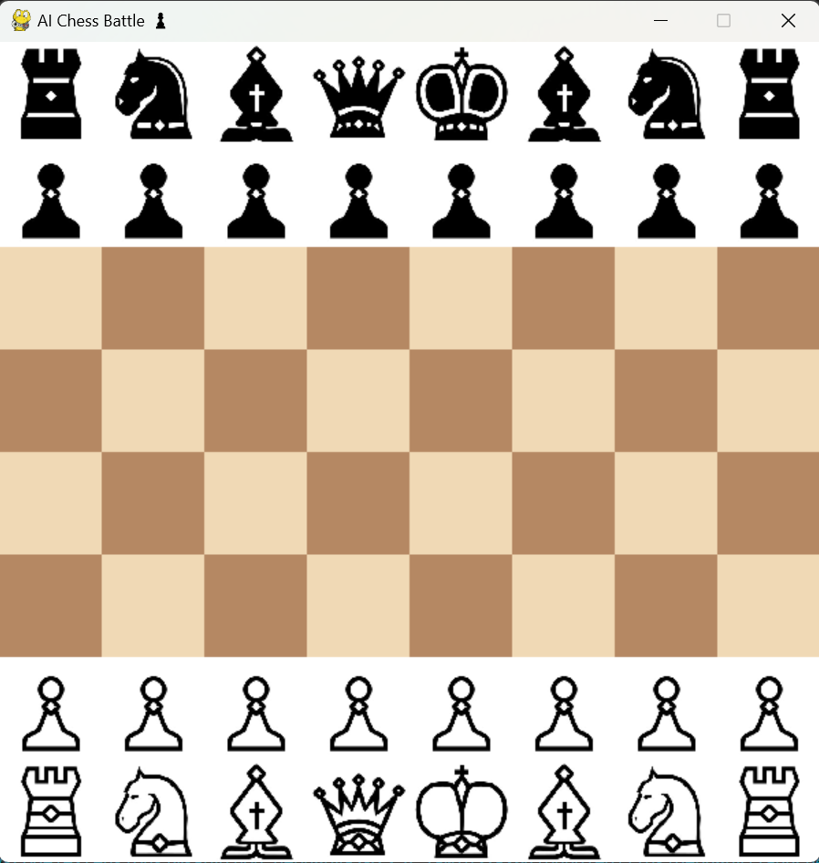
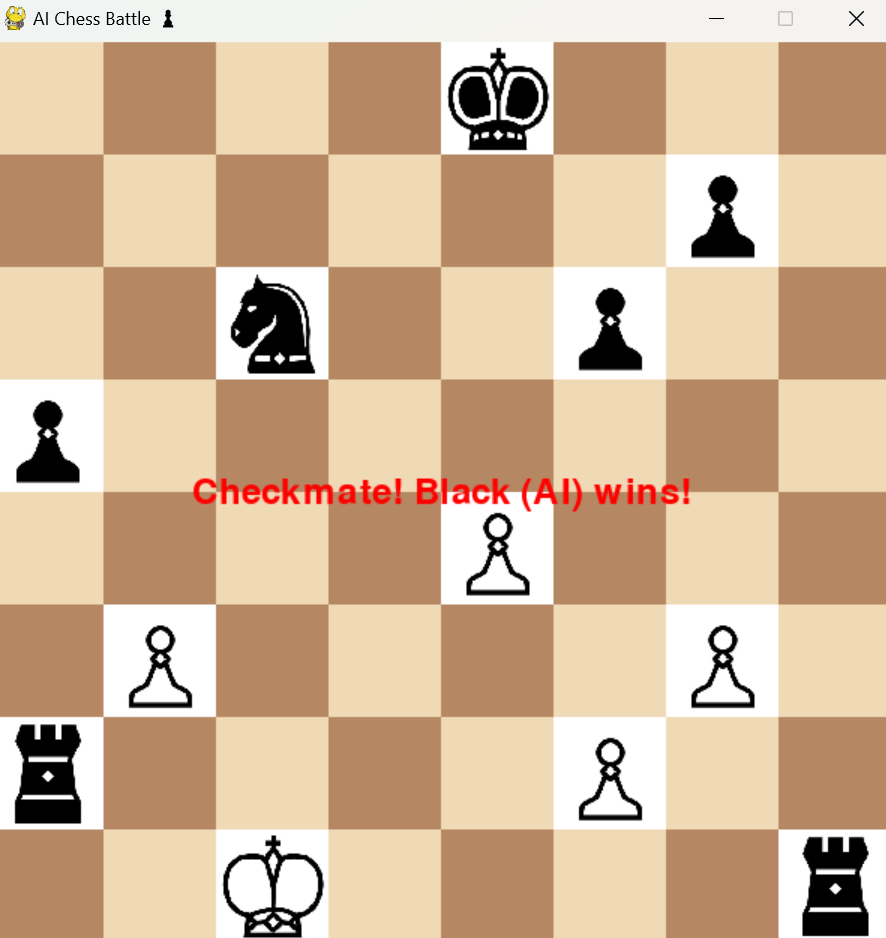

# ♟️ AI Chess Battle

Welcome to **AI Chess Battle**! 🎮🤖 A chess game built using **Pygame** and powered by the **Stockfish** engine for AI moves. Play against the AI and improve your chess skills! 🚀

## 📥 Installation

Follow these steps to set up and run the game:

### 1️⃣ Install Dependencies
Ensure you have **Python 3.10+** installed. Then, install the required libraries:
```bash
pip install pygame chess-engine
```

### 2️⃣ Download Stockfish Engine
Download the **Stockfish** chess engine from the [official website](https://stockfishchess.org/download/). Place the executable in the `stockfish` folder inside the project directory.

### 3️⃣ Clone the Repository
```bash
git clone https://github.com/yourusername/AI-Chess-Battle.git
cd AI-Chess-Battle
```

### 4️⃣ Run the Game
```bash
python Chess.py
```

## 🎮 How to Play
1. The game starts with **White (Player) vs. Black (AI)**.
2. Click on a piece to see its valid moves (highlighted in 🟡).
3. Click on a valid square to move your piece.
4. After your move, **AI will make its move automatically**.
5. The game continues until **checkmate, stalemate, or draw**.

## 📷 Screenshots



## 📂 Project File Structure
```
AI-Chess-Battle/
│── Chess.py              # Main game file 🏆
│── stockfish/
│   ├── stockfish.exe     # Stockfish engine ♟️
│── pieces/               # Chess pieces images 🎨
│   ├── wP.png            # White Pawn ⚪
│   ├── wN.png            # White Knight 🏇
│   ├── bP.png            # Black Pawn ⚫
│   ├── bK.png            # Black King 👑
│   └── ...
└── README.md             # Project documentation 📜
```

## 🏆 Features
✔️ **Human vs AI Mode** – Play against Stockfish 🤖
✔️ **Chess Piece Movement** – Drag and drop system ♟️
✔️ **Board Highlights** – Shows possible moves 🔆
✔️ **Game End Detection** – Checkmate, Stalemate, Draw 🚦
✔️ **Customizable AI Depth** – Adjust difficulty 🎚️
✔️ **Smooth Graphics** – Powered by Pygame 🎨

