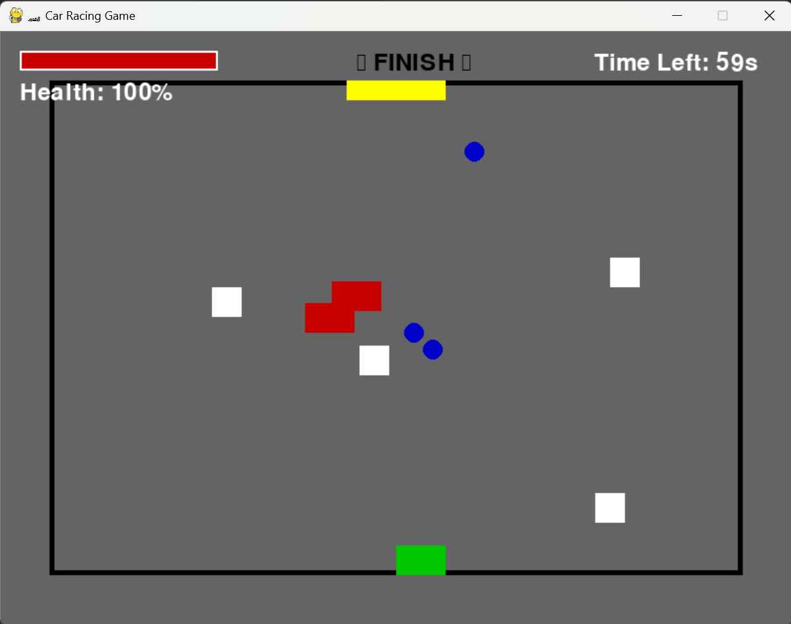
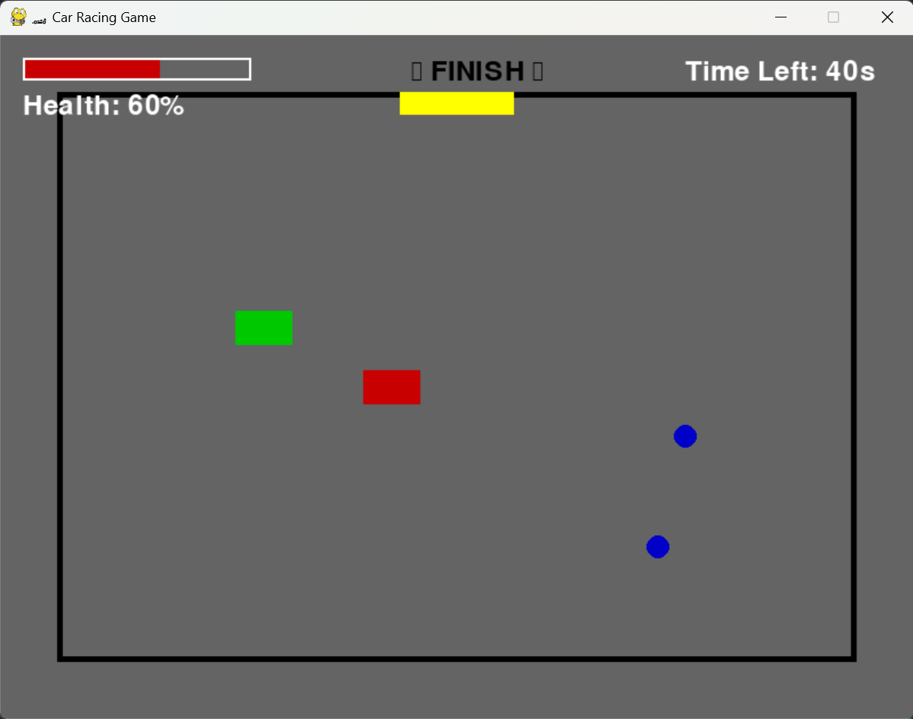
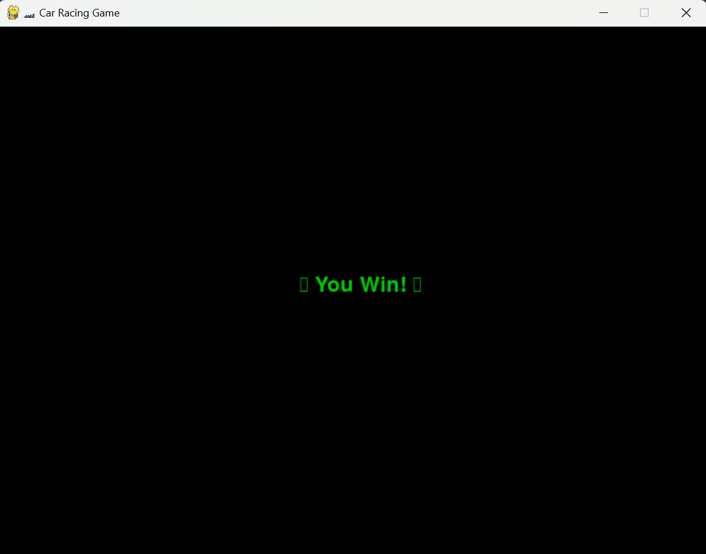

# 🏎️ Car Racing Game 🚀

Welcome to the **Car Racing Game**, an exciting 2D racing experience with AI opponents, speed boosters, obstacles, and a finish line! Compete against AI and reach the winning zone before time runs out! ⏳🏁

---

## 🎮 Game Overview

This is a **Python-based** car racing game built using **Pygame**. The player must race to the **FINISH Line** while avoiding obstacles and AI opponents. Speed boosters help increase speed, but collisions reduce health. The game ends when the player either **wins or loses** due to time running out or health depletion.

---

## 🚀 New Features Added

- ✅ **Race Track with Borders** 🛣️
- ✅ **Speed Boosters** ⚡
- ✅ **AI Opponents with Smarter Movement** 🤖
- ✅ **Winning Zone with FINISH Line** 🏁
- ✅ **Health System & Obstacles** 🛑
- ✅ **Countdown Timer** ⏳
- ✅ **Game Over & Win Conditions** 🎉

---

## 🛠️ Installation & Setup

### 1️⃣ Install Dependencies
Ensure you have **Python** installed on your system. Install `pygame` using:

```sh
pip install pygame
```

### 2️⃣ Clone the Repository

```sh
git clone https://github.com/your-username/car-racing-game.git
cd car-racing-game
```

### 3️⃣ Run the Game

```sh
python car_racing.py
```

---

## 🎮 How to Play

- Use **W / Up Arrow** 🔼 to move forward
- Use **S / Down Arrow** 🔽 to move backward
- Use **A / Left Arrow** ◀️ to steer left
- Use **D / Right Arrow** ▶️ to steer right
- **Avoid obstacles** 🚧 to maintain health
- **Collect speed boosters** ⚡ for a temporary speed boost
- **Reach the FINISH line** 🏁 before time runs out to **win**
- If health reaches **0%** or time runs out, **you lose** ❌

---

## 📌 Game Rules & Mechanics

- **Track Boundaries** 🛣️: The player must stay within the race track.
- **AI Opponents** 🤖: AI cars dynamically move towards the finish line.
- **Speed Boosters** ⚡: Increases speed temporarily when collected.
- **Obstacles** 🛑: Colliding with obstacles decreases health.
- **Health Bar** ❤️: If it reaches **0**, the game is over.
- **Timer** ⏳: Reach the finish line before time runs out!
- **Winning Condition** 🏁: Cross the finish line before AI & within the time limit.

---

## 📸 Screenshots








---

## 🛠️ Future Improvements

- 🚀 **More AI Difficulty Levels**
- 🚀 **Customizable Cars & Tracks**
- 🚀 **Multiplayer Mode**
- 🚀 **Leaderboard System**

---

