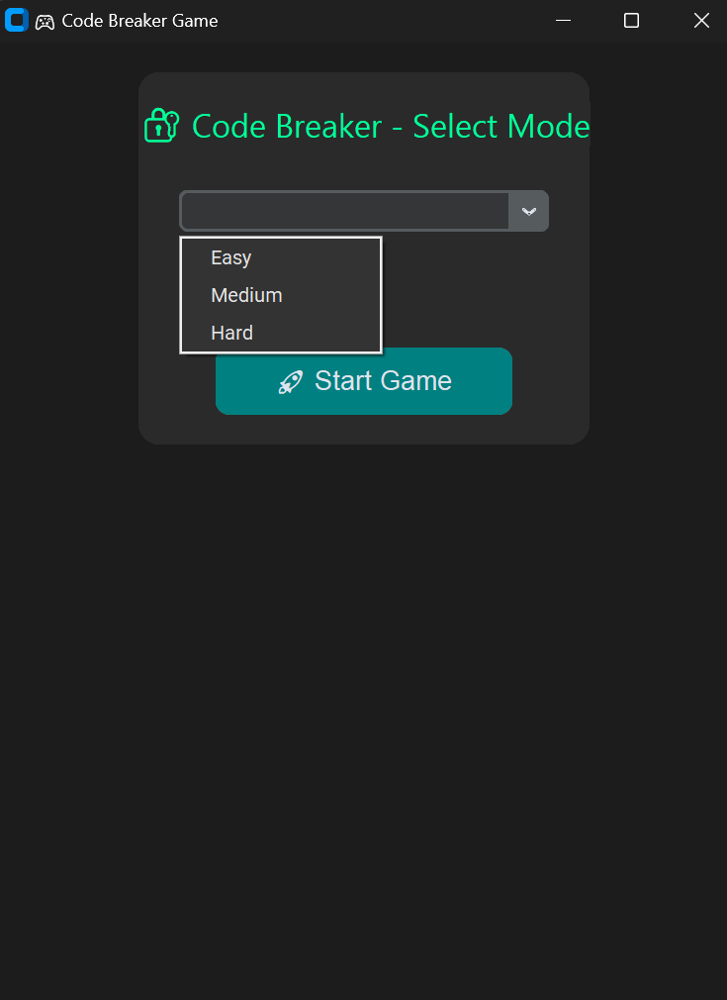
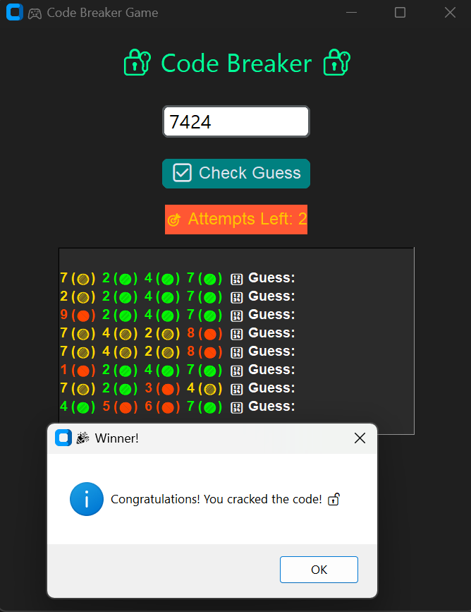
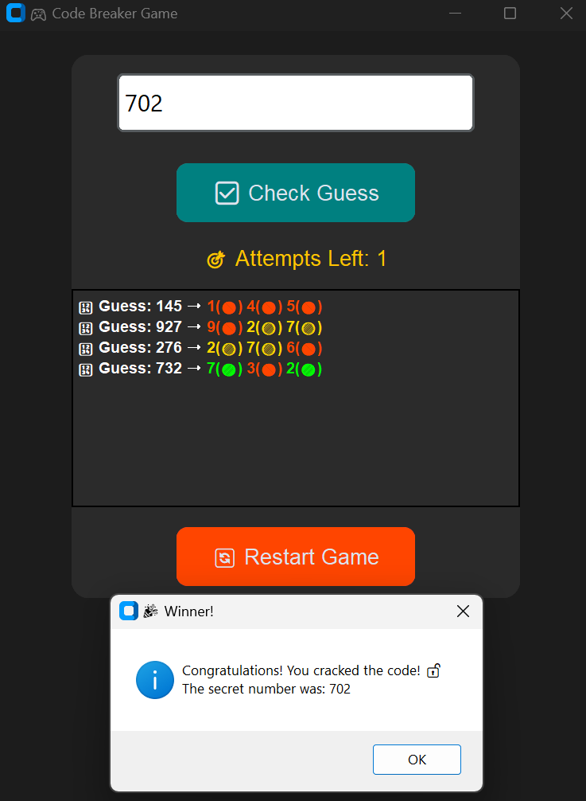
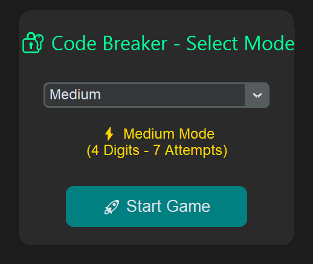
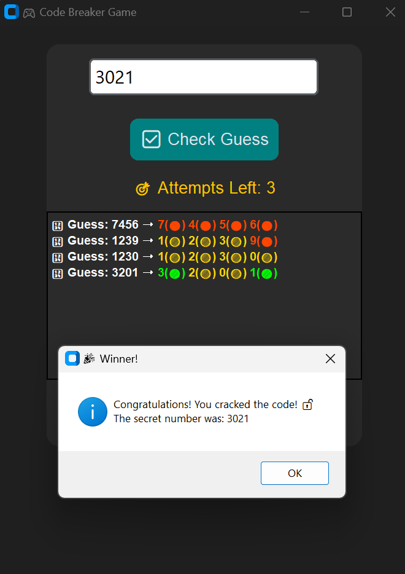
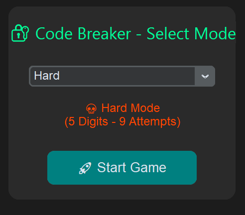
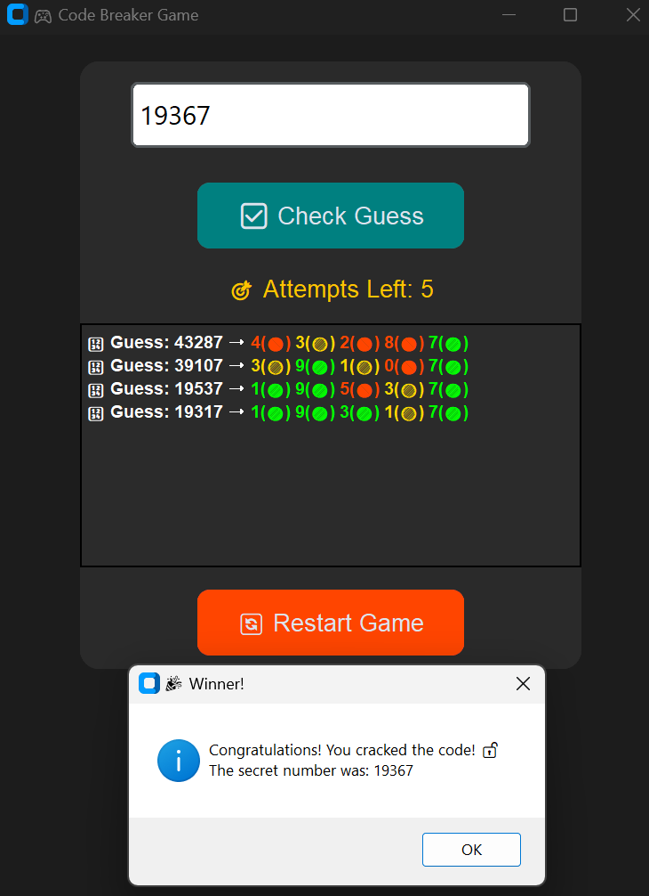

# 🎮 Code Breaker - The Ultimate Puzzle Challenge 🔐  

## 🧠 Game Concept  
**"Code Breaker"** is an exciting logic-based puzzle game where players must crack a secret code using hints! Sharpen your problem-solving skills while enjoying a fun and brain-teasing challenge!  

## 🕹️ How It Works  
- The game generates a **4-digit secret code** 🔢  
- Players enter their best guess and receive **color-coded hints** 🎨  
  - 🟩 **(Green)** - Correct number **in the correct position** ✅  
  - 🟨 **(Yellow)** - Correct number **but in the wrong position** 🔄  
  - 🔴 **(Red)** - Number is **not in the secret code** ❌  
- Use logic and strategy to **decode the number before running out of attempts!** 🎯  

## 🎯 Game Levels  
🔥 **Easy Mode** – 3-digit codes, **unlimited** attempts 😎  
⚡ **Medium Mode** – 4-digit codes, **10** attempts 🏆  
💀 **Hard Mode** – 5-digit codes, **7** attempts with fewer hints 💡  
👑 **Master Mode** – Guess **a secret word** instead of numbers! 🄤  

## 🛠️ Features  
✔️ **Interactive UI** – Built using `tkinter` for a smooth experience 🖥️  
✔️ **Timed Challenges** – Solve under pressure ⏳  
✔️ **Leaderboard** – Track **high scores & best times** 🏅  
✔️ **Multiplayer Mode** – Take turns setting and guessing codes 👥  
✔️ **Randomized Codes** – Ensures unique puzzles every time 🎲  

## 🎲 Example of Gameplay  
```
Secret Code: ????  
Player's Guess: 4523  
Hint: 🟩 🟨 🔴 🔴  (One number is correct & in place, one is misplaced, two are wrong)  
```
🔍 Keep guessing using hints until you **crack the code!** 🎯  

## 🚀 Installation & Setup  
```bash
# Clone the repo
git clone https://github.com/your-username/code-breaker.git

# Navigate to project directory
cd code-breaker

# Install dependencies (Python required)
pip install -r requirements.txt

# Run the game
python game.py
```  

## 🏢 Technologies Used  
🔹 **Python** – Core logic & backend  
🔹 **tkinter / pygame** – Graphical user interface 🎨  
🔹 **SQLite** – Store leaderboard data 📊  

## 🔥 Future Enhancements  
🔜 **Online Multiplayer** – Challenge friends remotely 🌍  
🔜 **More Difficulty Levels** – Extreme mode with 6+ digits 🔢  
🔜 **Custom Themes** – Players can pick different colors & styles 🎭  

## 💡 Contributing  
Want to improve the game? **Pull requests are welcome!** 🤝  

---

🎡 **Get ready to test your brainpower!** 🧠💡 Start breaking codes NOW! 🔐🎯  













