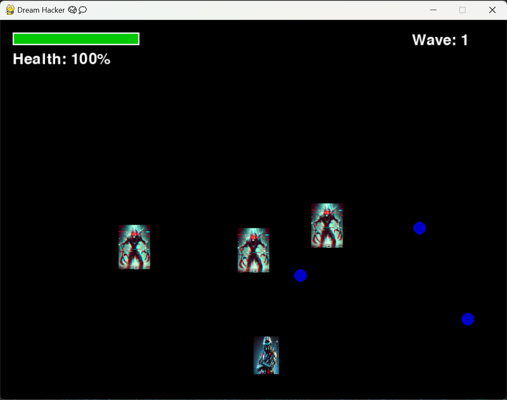

# Dream Hacker 🧠💭

A thrilling **2D adventure game** where you navigate a dream world, avoiding subconscious monsters while collecting memory fragments to unlock hidden secrets.

## 🎮 Features

- **Player Movement & Controls**: Move using **WASD** keys.
- **Enemies - Subconscious Monsters 👻**: AI-powered monsters that chase you.
- **Memory Fragments - Collectibles 🧩**: Gather all to win.
- **Disturbance Meter ⚠️**: Increases if a monster touches you.
- **Win & Lose Conditions**: Collect all fragments to win; disturbance meter reaches 100%, you lose.
- **Optimized Graphics**: Smooth animations and resized sprites.
- **Dynamic AI**: Monsters chase the player in real-time.
- **Future Improvements**: New levels, power-ups, sounds, and story mode.

## 🛠 Installation & Setup

### 1️⃣ Prerequisites
Ensure you have **Python 3.8+** and **pip** installed.

### 2️⃣ Install Dependencies
```sh
pip install pygame
```

### 3️⃣ Clone the Repository
```sh
git clone https://github.com/yourusername/DreamHacker.git
cd DreamHacker
```

### 4️⃣ Run the Game
```sh
python DreamHacker.py
```

## 📂 File Structure
```
DreamHacker/
│── assets/                 # Game assets (images, sounds)
│   ├── player.png          # Player sprite
│   ├── enemy.png           # Enemy sprite
│   ├── background.png      # Background image
│── main.py                 # Main game logic
│── config.py               # Game settings
│── README.md               # Project documentation
```

## 🎮 How to Play
- **Move** using `WASD`
- **Avoid** subconscious monsters 👻
- **Collect** all memory fragments 🧩
- **Monitor** the disturbance meter ⚠️
- **Win** by collecting all fragments, **Lose** if the meter reaches 100%

 


## 🚀 Future Improvements
- 🔹 Add **levels** with increasing difficulty
- 🔹 Introduce **power-ups** (e.g., shields)
- 🔹 Implement **sound effects & music**
- 🔹 More **enemy types** and AI improvements

---
**💡 Feel free to contribute!** 🎮✨