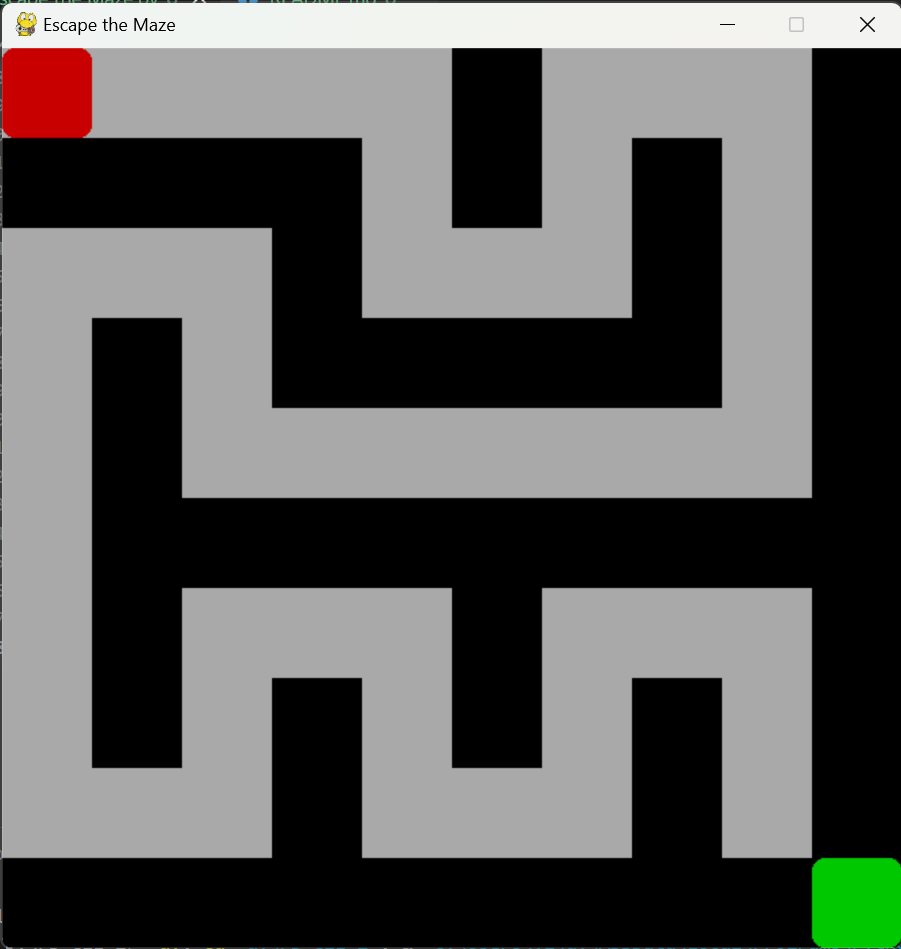

# 🏆 Escape the Maze

## 🎮 Game Concept
"Escape the Maze" is a fun and challenging puzzle game where players navigate through a randomly generated maze to reach the exit. The game tests your problem-solving and navigation skills as you race against time to find the way out.

## 🔥 Features
- 🏗️ **Random Maze Generation** – Every playthrough is unique!
- 🎮 **Keyboard Controls** – Move with arrow keys (`⬆️ ⬇️ ⬅️ ➡️`).
- 🏁 **Winning Condition** – Reach the green square to win!
- ⚡ **Smooth Animations** – For a great gameplay experience.
- ⏳ **Timer Mode (Optional)** – Solve the maze before time runs out.
- 🚀 **Multiple Levels** – Increasing difficulty as you progress.

## 🎯 How to Play
1. Start the game, and a random maze will be generated.
2. Use the **Arrow Keys** to move your character through the maze.
3. Reach the **Exit (Green Square)** to complete the level.
4. If enabled, complete the maze **before time runs out**!

## 🛠️ Installation & Setup
```bash
# Clone this repository
git clone https://github.com/your-username/escape-the-maze.git

# Navigate to the project directory
cd escape-the-maze

# Install required dependencies (if using Python and Pygame)
pip install pygame

# Run the game
python maze_game.py
```

## 🖥️ Technologies Used
- **Python** (Core logic and backend)
- **Pygame** (For graphical interface and animations)
- **Random Library** (For maze generation)

## 🚀 Future Enhancements
- **Multiplayer Mode** – Compete with friends online.
- **Power-ups & Obstacles** – Make the maze more challenging.
- **Customizable Maze Sizes** – Choose difficulty levels.

## 🤝 Contributing
Contributions are welcome! Feel free to open an issue or submit a pull request.

---
🎉 **Get ready to escape the maze and challenge your brain!** 🏆

