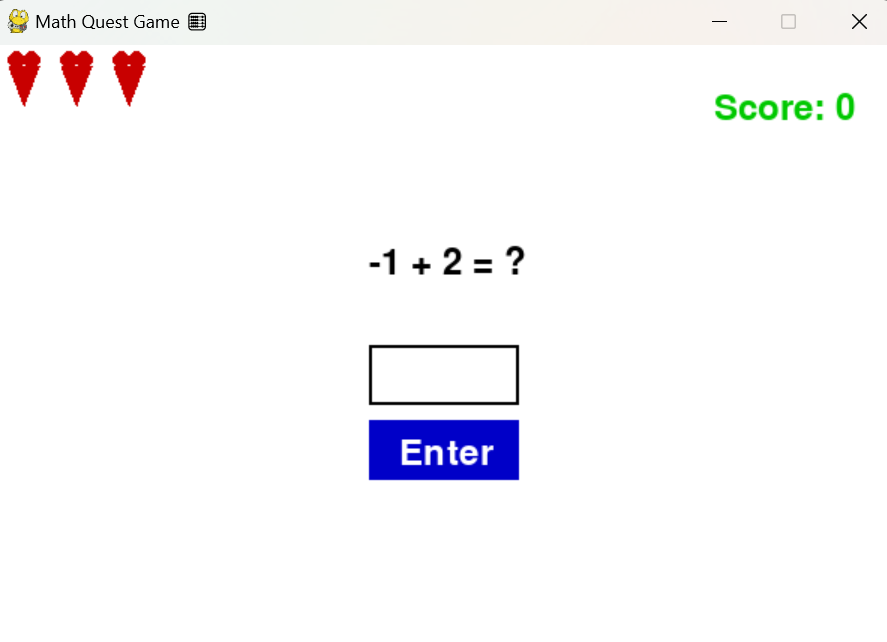
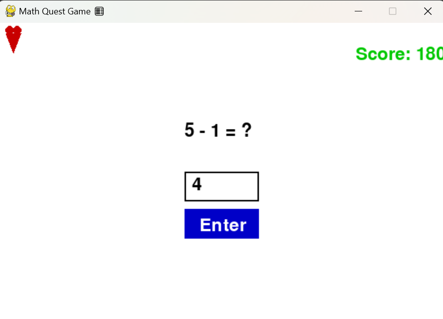

# 🎲✨ Math Quest Game 🏆🔥

## 🧮 About the Game 📚🕹️
Math Quest is a fun and interactive arithmetic game developed using Python and Pygame. Players solve randomly generated math problems involving addition ➕ and subtraction ➖. The game features a scoring system 🏅, health indicators (hearts ❤️), and a restart option 🔄 upon game over.

---

## 🎮 Features 🚀🎯
- 🎲 **Random Math Questions:** Generate math problems with addition ➕ and subtraction ➖.
- ❤️ **Dynamic Health System:** Three heart symbols representing player health.
- 🖥️ **User-Friendly UI:** Simple and easy-to-use interface with buttons 🔘 and text fields.
- 🏆 **Scoring System:** Gain points for correct answers.
- ❌ **Game Over & Restart:** Lose all lives 💔, and the game displays a restart option 🔄.
- ⌨️ **Keyboard & Mouse Support:** Answer questions using keyboard 🎹 or mouse 🖱️.

---

## 🛠️ Installation Guide 🔧💡
### Prerequisites 📌
Ensure you have Python 🐍 installed on your system. You can download Python from:
🔗 [Python Official Website](https://www.python.org/downloads/)

### Step 1: Install Pygame 🎮
To run the game, you need to install Pygame. Open a terminal or command prompt and type:
```
pip install pygame
```

### Step 2: Clone or Download the Repository 📂📥
Clone the repository using Git:
```
git clone https://github.com/yourusername/math-quest-game.git
```
Or download the ZIP file and extract it 📂.

### Step 3: Run the Game ▶️
Navigate to the folder and run the Python script:
```
python math_quest.py
```

---

## 🎯 How to Play 🏹💡
- 🧠 **Solve Math Problems:** A math equation will be displayed.
- 🎹 **Enter Your Answer:** Type the answer using your keyboard.
- ✅ **Submit:** Press `Enter` ⏎ or click the "Enter" button to submit your answer.
- 📊 **Scoring:**
  - ✅ +10 points for a correct answer.
  - ❌ No points deducted for wrong answers.
- ❤️ **Health System:**
  - You have **3 hearts** ❤️ at the start.
  - ❌ A wrong answer reduces one heart.
  - 💔 The game ends when all hearts are gone.
- 🔄 **Restarting the Game:**
  - If you lose all lives, a "Game Over" message will appear.
  - Press `R` 🔁 to restart the game.

---





## 🏆 How to Win 🎖️🚀
- 🎯 Score as many points as possible by answering correctly.
- 💖 Maintain your health by avoiding wrong answers.
- 🎉 Challenge yourself to beat your high score!

---

## ❌ How You Lose ☠️😢
- Giving three incorrect answers will deplete all your hearts 💔, leading to a **Game Over**.
- At this point, you can restart the game by pressing `R` 🔄.

---

## 📝 Future Improvements 🚀💡
- ✖️➗ **Multiplication & Division** questions.
- 🔥 **Difficulty levels** (Easy, Medium, Hard).
- 🏅 **Leaderboard system** to track top scores.
- 🔊 **Sound effects & animations** to enhance gameplay.

---


**Happy Learning & Have Fun Playing! 🎮🎉🥳**