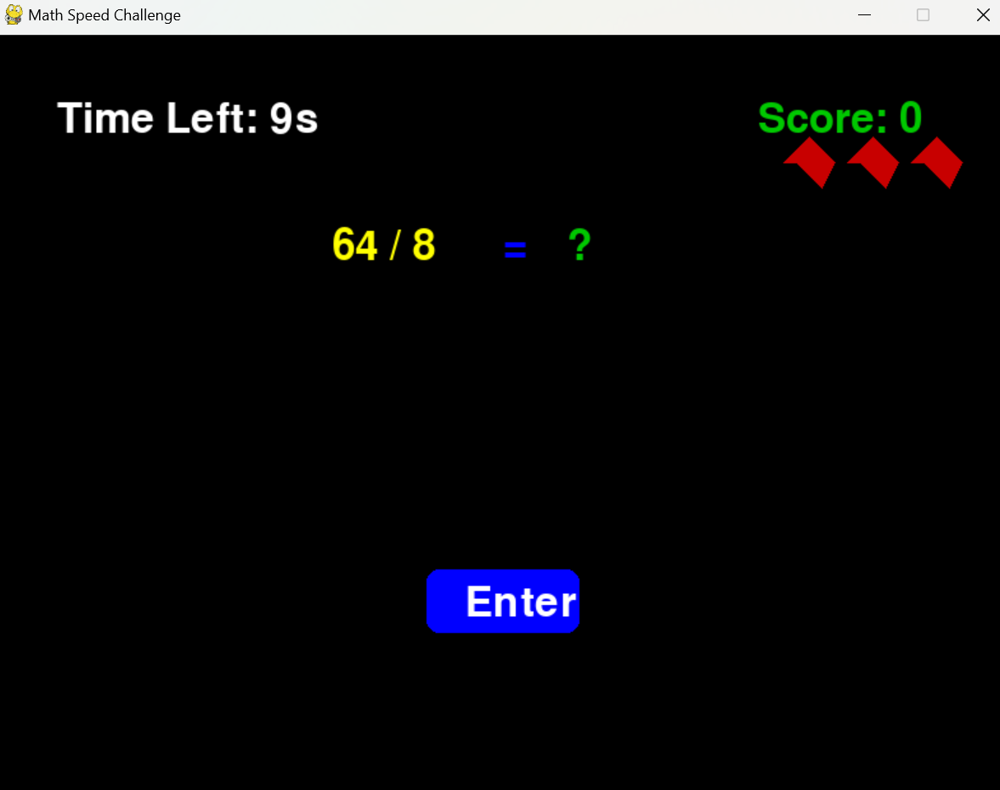
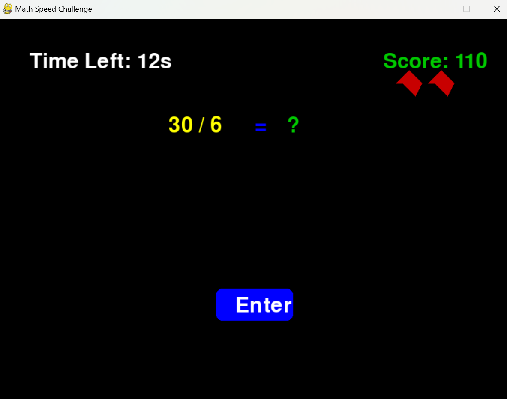
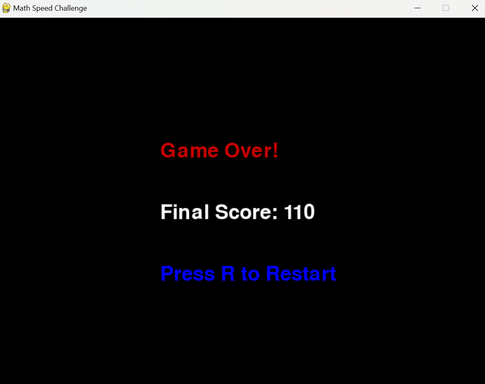

# 🎲🔥 Math Speed Challenge 🏆💥

## 📌 About the Game 🌟🎮
The **Math Speed Challenge** is an **exciting and fast-paced** game where players solve **random math problems** as quickly as possible before the timer runs out! ⏳

📅 The game includes **addition** ➕, **subtraction** ➖, **multiplication** ✖, and **division** ➗ questions.

🚀 The **faster** you answer, the **more challenging** the game gets!

---

## 🎮 How to Play 🎶🎨
- 📉 A **random math question** appears on the screen.
- 🌍 You have **10 seconds** to type your answer.
- ✅ **Correct answer:** Gain **+10 points** 🏆 and the timer gets shorter!
- ❌ **Wrong answer:** Lose **1 heart** ❤️.
- 😭 **Out of time?** Lose **1 heart** ❤️.
- 💔 Lose **all 3 hearts**? **Game Over!** 💀
- 🔄 Press **R** to restart the game after losing. 

---

## 🏆 How to Win 🎮🚀
- 🎉 Score as **many points** as possible before running out of lives!
- ⏳ The **faster** you answer, the **higher** your score will be!
- 💡 Challenge yourself to **beat your high score!** 🚀🏅

---

## ❌ How You Lose ⚡️💔
- 💥 If you **run out of time** before answering.
- 📉 If you **give the wrong answer** too many times.
- ❤️ Losing all **3 hearts** = **Game Over!** 💀

---







## 🚀 Features 🌟💪
✅ **Random math problems** (+, -, ✖, ➗) 
✅ **Countdown timer** ⏳ 
✅ **Dynamic difficulty** – **faster game as you progress** 🔥  
✅ **Score & Lives System** ❤️  
✅ **Game Over & Restart Feature** 🔄  
✅ **Fun and educational!** 🎓  
✅ **Engaging UI** 🎨 
✅ **Smooth keyboard input support** ⌨️ 

---

## 💻 Controls 🌟
- ⌨️ **Type** your answer using the keyboard.
- ⏎️ Press **Enter** to submit your answer.
- ⌫ Press **Backspace** to delete numbers.
- 🔄 Press **R** after Game Over to restart.

---

## 📂 Installation & Running the Game 🔧🌟
1. Install **Python** 🐍 (if not already installed).
2. Install **Pygame** using:
   ```bash
   pip install pygame
   ```
3. Run the game script:
   ```bash
   python math_speed_challenge.py
   ```

---

## 🎯 Future Enhancements 🌟🚀
- 🎧 Add **sound effects** for correct and wrong answers.
- 🏆 Implement a **Leaderboard** to track high scores.
- ⏳ Add **power-ups** like extra time or bonus points.
- 🤝 Introduce a **multiplayer mode** for competition!

🚀 Enjoy the challenge and have fun learning! 📚🎲🚀