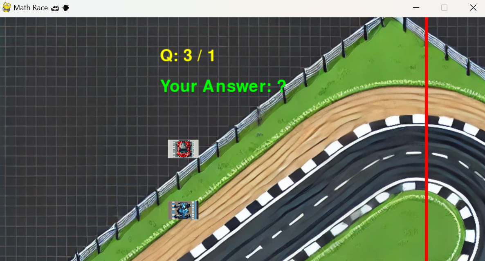
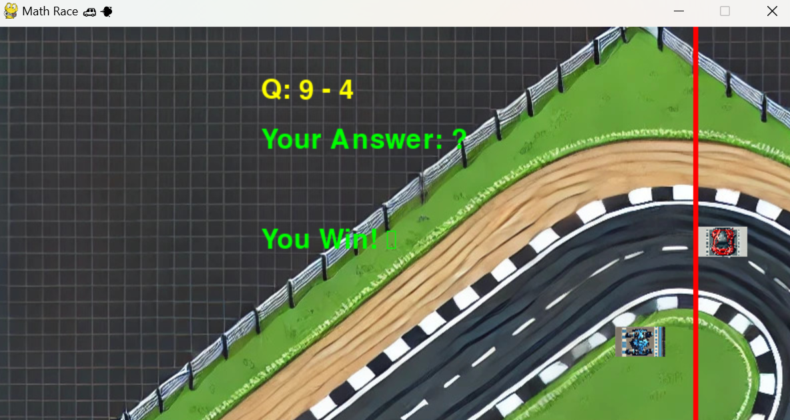
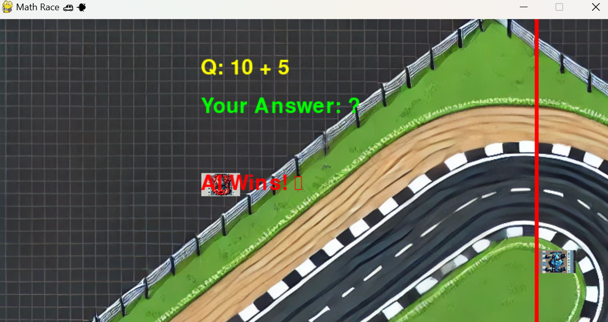

# 🏁 Math Race Game 🚗💨

A **fun & educational** racing game where your **math skills** decide your speed! 🎮🧮 Solve math problems correctly to **boost your car's speed** and beat your AI opponent! 🤖💥

---

## 📂 File Structure 📂
```
MathRace/
│── assets/ 🎨 (Game images & assets)
│   ├── track.jpg 🏎️ (Race track background)
│   ├── car.jpg 🚗 (Player’s car image)
│   ├── ai_car.jpg 🤖 (AI’s car image)
│
│── game.py 🎮 (Main game loop & logic)
│── config.py ⚙️ (Game settings & configurations)
│── player.py 🚗 (Player car movement & logic)
│── ai.py 🤖 (AI car movement & logic)
│── math_questions.py 🔢 (Math problem generator)
│── README.md 📜 (Game documentation)
```

---

## 🎮 Game Features 🎮
- ✅ **Exciting racing gameplay** 🏎️💨
- ✅ **AI competitor to challenge you** 🤖🏁
- ✅ **Dynamic math problems** 🧮🔢
- ✅ **Speed boost for correct answers** 🚀✨
- ✅ **Easy controls with keyboard** ⌨️🖥️
- ✅ **Simple & engaging UI** 🎨📺
- ✅ **Infinite replayability** 🔁🔥

---

## 🚀 How to Play 🚀
- 1️⃣ **Start the game** 🎮 by running `game.py` 🏁
- 2️⃣ **A math question appears** 📢 (e.g., 8 + 3 = ?)
- 3️⃣ **Type your answer** using the keyboard ⌨️
- 4️⃣ **Press ENTER** to submit your answer ✅
- 5️⃣ **If correct** 🎯 → Your car gets a **speed boost** ⚡
- 6️⃣ **If wrong** ❌ → No speed boost, AI keeps moving 🤖
- 7️⃣ **Reach the finish line first to win!** 🏆🥳

---

## 🏆 How to Win 🏆
- ✔️ Solve math questions **quickly & correctly** ✅⚡
- ✔️ Get **more speed boosts** than the AI 🚀
- ✔️ Cross the **finish line first** at the right side of the screen 🏁

---

## ❌ How You Lose ❌
- ❌ If the **AI car reaches the finish line first** 🤖🏁
- ❌ If you **answer too many questions wrong** ❌
- ❌ If you **take too long** to answer ⏳🐢

---







## 🛠️ Installation & Setup 🛠️
🔹 **Step 1:** Install Python (if not installed) 🐍
🔹 **Step 2:** Install dependencies 📦
```sh
pip install pygame
```
🔹 **Step 3:** Run the game 🎮
```sh
python game.py
```

---

## 🔮 Future Enhancements 🔮
✨ **Multiplayer Mode** (Play with friends! 👫🎮)
✨ **Different difficulty levels** (Easy, Medium, Hard 🎚️)
✨ **More AI opponents** 🤖🤖🤖
✨ **Power-ups & obstacles** ⚡🚧
✨ **New tracks & car designs** 🏎️🎨


---

🎮 **Get ready for the ultimate Math Race!** 🚗💨💥 Have fun solving problems & winning races! 🏆🔥