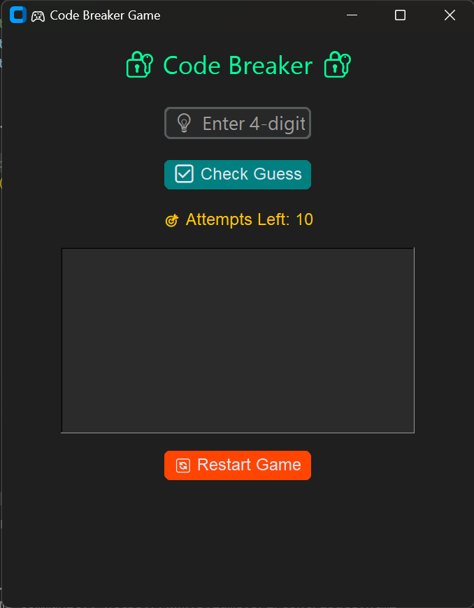

# 🎮 My Python Games 🚀🔥

## 1⃣ AI Chess ♟️🤖
**Description:** A Python-based AI Chess game using the `pygame` and `python-chess` libraries. It includes an AI opponent powered by the Stockfish chess engine.

**✨ Features:**
- 🎨 Interactive chessboard with piece movement.
- 🤖 AI opponent with Stockfish integration.
- 🔍 Valid move highlighting.
- 🏆 Game result detection (Checkmate, Stalemate, etc.).

**🛠️ Installation & How to Play:**
1. 📅 Install dependencies: `pip install pygame chess`
2. 🔧 Download and configure Stockfish.
3. ▶️ Run the script: `python Chess.py`
4. 🎭 Play against AI or manually move pieces!

---

## 2⃣ Code Breaker 🔐🕹️
**Description:** "Code Breaker" is a logic-based puzzle game where players must decode a secret number or word using clues and patterns. The game challenges problem-solving skills while keeping it fun and engaging.

**✨ Features:**
- 🎲 Randomized secret codes for fresh gameplay.
- 💡 Hint system: 
  - 🔵 Correct number in the correct place.
  - 🟡 Correct number but in the wrong place.
  - ❌ Wrong number.
- ⏱️ Timer mode for an extra challenge.
- 🔥 Different difficulty levels (Easy, Medium, Hard, Master).
- 🏆 Leaderboard to track best scores.
- 🎭 Multiplayer mode where two players take turns guessing.

**🛠️ Installation & How to Play:**
1. 📅 Install dependencies: `pip install -r requirements.txt`
2. ▶️ Run the script: `python game.py`
3. 🎲 Decode the secret code using hints!

---

### 📌 Note:
- 🎨 Ensure all required assets (images, sounds, etc.) are in the correct directories.
- ⚙️ Customize configurations if needed.
- 🎮 Have fun playing! 🚀🔥🎉